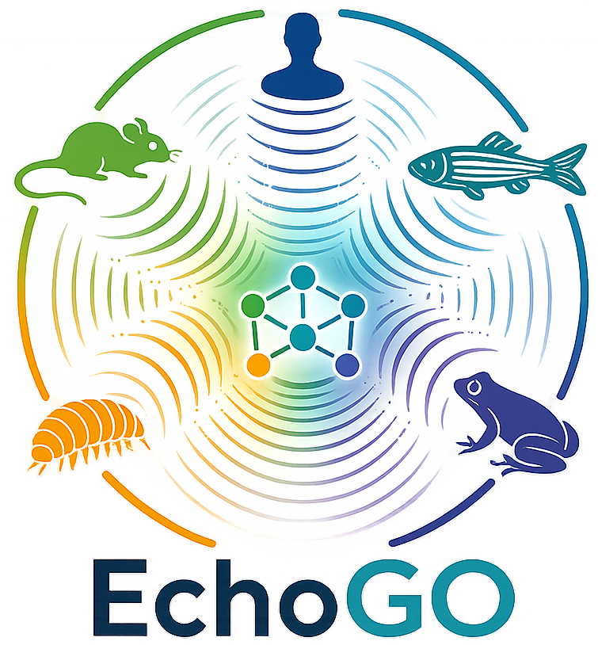

# EchoGO



### Annotation-context-aware functional interpretation of transcriptomic data

[](https://www.r-project.org/)
[](https://www.gnu.org/licenses/gpl-3.0.html)
[](https://doi.org/10.5281/zenodo.17658714)

Understand what your experiment supports, how annotation context shapes that interpretation, and which additional functions deserve follow-up.

EchoGO is an R framework for **functional interpretation and hypothesis generation after differential-expression analysis**. It keeps the target GOseq analysis central, examines the same transcriptomic response through researcher-selected organism annotation resources, and retains the source of every GO-term result. It does not combine evidence into a new significance statistic.

**Start here:** [Offline demo](#try-the-full-offline-demonstration) · [Your own experiment](#bring-your-own-experiment) · [Interpretation](#read-the-evidence-not-a-composite-score) · [Validation](#three-complementary-validation-exercises)

<br clear="right">

## Why annotation context matters

An experiment can measure many features yet connect only a small portion of them to functional annotation. This is especially important for de novo transcriptomes and non-model organisms, where unresolved identifiers and uneven annotation can obscure biological responses. Even in a reference-rich system, different organism resources can expose different parts of the same response.

EchoGO makes this dependence visible. Researchers choose annotation contexts for biological reasons—such as taxonomic proximity, relevant physiology or annotation coverage—and inspect what those choices recover. The contexts are **alternative resources for interpreting one experiment**, not additional experiments or independent biological replicates. EchoGO does not select a universally best reference organism.

### Three kinds of evidence, one experimental anchor

| Evidence category | Biological reading |
|:--|:--|
| **Target only** | Supported by target GOseq, without qualifying recovery in an alternative annotation context. Lack of recovery elsewhere does not negate the target result. |
| **Target + context** | Supported by target GOseq and recovered in at least one alternative annotation context. Additional recovery describes annotation-context support, not stronger combined significance. |
| **Context-derived hypotheses** | Recovered in an alternative annotation context without qualifying target GOseq support. These are traceable leads for biological follow-up. |

A queried target-organism g:Profiler context is recorded separately from alternative contexts. It does not count as alternative-context recurrence. GO terms without primary qualifying support do not become hypotheses simply because they appear in an exploratory result.

## From experiment to interpretation

<p align="center">
  
</p>

The main workflow starts with completed differential-expression and target GOseq analyses. GOseq supplies the target experimental anchor; g:Profiler evaluates the resolved experimental foreground against its matched tested-feature background in selected annotation contexts. These routes meet at **GO-term evidence assembly**, not at p-value aggregation. Semantic reduction, networks and reports then help interpret that evidence while retaining its provenance.

## Install EchoGO v0.1.4

The simplest route is to install the tagged release directly from GitHub in R. EchoGO requires R ≥ 4.1; v0.1.4 was verified with R 4.4.3. Installing source dependencies may require system build tools, and HTML reports require Pandoc (normally supplied by RStudio).

```r
install.packages(c("remotes", "BiocManager"))

remotes::install_github(
  "miloes114/EchoGo@v0.1.4",
  dependencies = TRUE,
  upgrade = "never"
)

library(EchoGO)
packageVersion("EchoGO")
browseVignettes("EchoGO")
```

The full offline demonstration uses the zebrafish semantic reference `org.Dr.eg.db`. Install it if you want to run that example:

```r
BiocManager::install("org.Dr.eg.db", ask = FALSE, update = FALSE)
```

For an exact archived copy, the stable software archive has [concept DOI 10.5281/zenodo.17658714](https://doi.org/10.5281/zenodo.17658714), the v0.1.4 archive has [version DOI 10.5281/zenodo.23158481](https://doi.org/10.5281/zenodo.23158481), and the built `EchoGO_0.1.4.tar.gz` package remains available from the [v0.1.4 GitHub release](https://github.com/miloes114/EchoGo/releases/tag/v0.1.4). The default GitHub branch may contain later development updates, so use the tagged command above when reproducing v0.1.4.

## Try the full offline demonstration

```r
library(EchoGO)

demo <- echogo_quickstart(
  run_demo = TRUE,
  full = TRUE,
  live_gprofiler = FALSE,
  outdir = "echogo_demo_run"
)
```

This copies the packaged example, uses cached g:Profiler results, and runs the richer interpretation workflow: exact-term evidence, recognition diagnostics, eligible RRvGO summaries, networks, evaluation and a styled HTML report. The full demo also illustrates the **separate optional default-domain exploratory layer**. It is an illustration of the workflow, not a reanalysis of the three manuscript validation cases.

The report opens automatically in an interactive session. Its path is returned with the results:

```r
demo$files$report_html
browseURL(demo$files$report_html)
```

Look in `echogo_demo_run/echogo_demo/results/report/`. Keep the report's companion assets and the surrounding result tree together when moving or sharing it. A semantic product may legitimately be skipped when too few eligible terms can be compared; the report records that condition rather than inventing a summary.

For a lighter first run without RRvGO or evaluation:

```r
echogo_quickstart(
  run_demo = TRUE, full = FALSE, live_gprofiler = FALSE,
  outdir = "echogo_demo_light"
)
```

Use a dedicated demo directory: the default `clean = TRUE` replaces that demo's previous results on rerun. Never point it at a directory containing your own analysis results.

## Bring your own experiment

### Prepare the biological inputs

EchoGO supports reference-based and de novo studies. Your upstream software and directory names need not match the demonstration; explicit file paths are the clearest starting point.

| Input | What it must represent |
|:--|:--|
| Differential-expression results | Feature IDs and the experiment's DE decision, or adjusted p-values and log2 fold changes from which to derive it. A full tested-feature table is preferable to a significant-only export. |
| Tested-feature background | All features available for DE testing, not just significant features and not every entry in an annotation database. Supply an explicit vector when the DE table alone does not establish it. |
| Annotation / identifier mapping | A compatible Trinotate or prepared eggNOG-derived table linking experimental IDs to supported name fields. Preserve unmapped and many-to-one mappings for interpretation. |
| Target GOseq results | Precomputed target enrichment with `category`, `term`, `ontology`, `numDEInCat`, `numInCat`, `over_represented_FDR` and `gene_ids` columns. These provide the primary evidence. |
| Annotation contexts | g:Profiler organism codes chosen for the biological question, an explicit target-context declaration, and a rationale for alternatives. |
| Semantic reference, if using RRvGO | An installed OrgDb and its declared role as `target_reference` or `proxy`. This choice controls semantic summarization, not exact-term support. |

Existing DE significance flags are honored. Otherwise, the default foreground rule is adjusted p-value ≤ 0.05 and absolute log2 fold change ≥ 1; configure these arguments to match your experimental analysis. Do not silently substitute those defaults for a different pre-specified DE rule.

An explicit `tested_gene_ids` vector takes precedence over background inference. A full DE table can supply the tested universe; a matching count matrix is a fallback when a significant-only DE table is explicitly declared. Use `de_table_significant_only = TRUE` in that situation. Do not supply a significant-only table as though it were the tested universe.

### Choose and declare annotation contexts

The following is an **illustrative zebrafish configuration**, not the manuscript's validation panel and not a recommended panel for all organisms. Replace the paths, column names, contexts and rationales with those appropriate to your experiment.

```r
contexts <- c("drerio", "omykiss", "hsapiens")
context_info <- data.frame(
  context_code = contexts,
  context_rationale = c(
    "Target organism's annotation resource",
    "Comparative teleost resource relevant to the study question",
    "Well-annotated vertebrate resource for broader functional comparison"
  )
)

# A headered table with one row per DE-tested experimental feature.
tested <- read.delim("inputs/tested_features.tsv", stringsAsFactors = FALSE)

result <- run_full_echogo(
  de_file = "inputs/de_results.csv",
  goseq_file = "inputs/target_goseq.tsv",
  trinotate_file = "inputs/annotation_for_EchoGO.tsv",
  tested_gene_ids = tested$gene_id,
  de_id_column = "gene_id",
  de_padj_column = "padj",
  de_lfc_column = "log2FoldChange",
  annotation_id_column = "transcript_id",
  species = contexts,
  target_context = "drerio",
  context_metadata = context_info,
  run_exploratory_default_domain = FALSE,
  run_rrvgo = TRUE,
  semantic_reference_orgdb = "org.Dr.eg.db",
  semantic_reference_role = "target_reference",
  run_evaluation = TRUE,
  make_report = TRUE,
  outdir = "results/my_experiment"
)
```

**This own-data call uses g:Profiler's online service.** The demo's `live_gprofiler` argument is not an argument to `run_full_echogo()`. Preserve the resulting caches, submitted vectors and metadata with your results. Availability and annotation content of live resources can change.

If none of the selected contexts represents the target organism, explicitly use `target_context = NA_character_`. Target GOseq remains the experimental anchor. For a proxy semantic reference, declare `semantic_reference_role = "proxy"` and document why it is appropriate. If semantic reduction is not justified or not wanted, use `run_rrvgo = FALSE` and omit the semantic-reference arguments.

### Helpers and preparation guides

```r
echogo_scaffold("my_project")  # Create a template, not biological inputs
echogo_pick_species()         # Browse available annotation contexts
echogo_help()
vignette("reference-based-inputs", package = "EchoGO")
```

The scaffold documents supported layouts; automatic `input_dir` discovery is a convenience, not a scientific requirement. Its standard layout includes a count matrix. Use explicit paths and a tested-feature vector, as above, when your inputs are organized differently.

For reference-based studies, `echogo_prepare_reference_inputs()` provides a staged GFF/GTF, protein FASTA and annotation-mapping workflow, including GOseq preparation. External annotation steps and dependencies are described in the [reference-based guide](vignettes/reference-based-inputs.Rmd). For de novo/Trinotate inputs, begin with the [workflow guide](vignettes/EchoGO_workflow.Rmd). These preparation routes feed the same downstream evidence model.

## Why the background matters

The foreground and background must describe the **same experiment**. EchoGO resolves the DE foreground and complete tested-feature background using the same identifier procedure, then submits the same portable foreground and background vectors to every selected context.

Resolution prioritizes supported SwissProt gene symbols, then eggNOG preferred names, then portable native symbols. Raw contig/transcript identifiers or seed-ortholog accessions are not substitutes for portable submitted names. Several experimental features can collapse to one name, and others may remain unresolved.

Each annotation context may recognize a different subset of those submitted names. Its **effective query and statistical domain can therefore differ**, even though the submitted vectors are identical. EchoGO records mapping and recognition information so these differences can be inspected. This is context-specific recognition—not construction of species-specific ortholog vectors and not explicit orthology filtering.

Do not replace the experiment-specific background with an entire organism database to increase apparent coverage. The optional default-domain analysis asks a different exploratory question and stays separate from the primary evidence model.

## What you receive

Paths below are relative to your analysis output directory. Available plots depend on eligible terms and the options selected.

| Product | Where to look | What it tells you |
|:--|:--|:--|
| Biological HTML report | `report/` | Key findings, evidence landscape, recognition diagnostics, semantic products and networks, with links to underlying results. |
| Target evidence | `goseq/` | The supplied target functional analysis and its source-local evidence. |
| Contextual enrichment | `gprofiler/` | Per-context results, cached responses, effective query/domain metadata and run provenance. |
| Identifier audit | `gprofiler/submitted_vectors/` | Original and resolved foreground/background, `mapping_table.csv` and `gene_set_contract.json`. |
| Exact-term evidence | `consensus/term_evidence_exact.csv` | GO-term membership, evidence profiles and descriptive alternative-context recurrence. |
| Source provenance | `consensus/term_source_provenance_long.csv` and `consensus/context_configuration.csv` | Which analysis/context supports each term, with source-local statistics and declared context roles. |
| Semantic summaries | `rrvgo/` | Separate target-supported and context-derived-hypothesis products using `Rel` similarity; representative terms and semantic-reference provenance. |
| Gene-sharing networks | `networks/` | Relationships between terms through associated genes; an interpretation aid, not new enrichment evidence. |
| Evaluation / diagnostics | `evaluation/` | Descriptive comparisons and diagnostics, not a ground-truth performance score or combined significance test. |
| Optional exploratory layer | Separately labelled result/report sections | Default-domain g:Profiler evidence, excluded from primary profiles, recurrence and primary downstream products. |

## Read the evidence, not a composite score

1. **Start with target-supported biology.** Read Target only and Target + context together as the target GOseq result, then ask what additional annotation-context recovery clarifies.
2. **Inspect where each result came from.** Adjusted p-values and fold enrichment belong to the GOseq or g:Profiler analysis that generated them. They are not pooled, maximized or minimized into a new significance measure.
3. **Treat recurrence as description.** Recovery in several alternative resources records annotation-context recurrence. It is neither independent replication nor evidence of functional conservation; resources can share annotation history.
4. **Follow hypotheses back to their genes and mappings.** Context-derived hypotheses are candidates for biological investigation. Absence of qualifying evidence can reflect recognition or annotation limits, not biological absence.
5. **Use summaries to navigate, not to redefine support.** RRvGO reduces redundancy within separate evidence products. Its OrgDb is semantic provenance only; networks and reports do not change exact-term evidence membership.

## Three complementary validation exercises

The manuscript pairs a reference-rich zebrafish exposure contrast (**ZEB**) with two field contrasts in the annotation-limited de novo *Gammarus* transcriptome (**GAM1**, **GAM2**). ZEB illustrates context dependence despite a well-annotated target. The Gammarus contrasts illustrate how limited portable-name representation constrains accessible functional information.

| Case | Target GOseq terms | Target only | Target + context | Context-derived hypotheses |
|:--|--:|--:|--:|--:|
| ZEB | 44 | 2 | 42 | 180 |
| GAM1 | 194 | 178 | 16 | 19 |
| GAM2 | 59 | 34 | 25 | 20 |

Target GOseq terms equal Target only plus Target + context. Hypotheses are additional context-derived terms, **not a measure of superior performance**. The cases demonstrate biological interpretation under different annotation conditions, not a benchmark with known truth labels.

The revised **EchoGO validation and reproducibility compendium v2.0.0** preserves **historical source enrichment** separately from **current v0.1.4 interpretation**, with case reports, submitted vectors, provenance, semantic products and the reproducible Figure 2 evidence landscape. Historical g:Profiler enrichment was reused rather than rerun simply to relabel it v0.1.4. The current archived release is [Zenodo DOI 10.5281/zenodo.23164928](https://doi.org/10.5281/zenodo.23164928); the stable compendium concept DOI is [10.5281/zenodo.21476745](https://doi.org/10.5281/zenodo.21476745). The compendium README is the entry point for reproducibility and the historical/current analysis boundary.

## Scope and limitations

EchoGO can only interpret the functional information accessible through the input annotation, identifier resolution and chosen resources. Uneven annotation gives well-characterized and broadly conserved functions more opportunities to be represented; lineage-specific or sparsely annotated functions may remain inaccessible. Context choice consequently shapes the interpretation.

Improving upstream annotation can expand the accessible functional space. Additional contexts are useful when biologically justified, but they cannot repair missing experimental information or guarantee that an unresolved function is absent. Keep the experimental design, feature unit, tested universe and mapping limitations alongside every interpretation.

## Guides, citation and support

| Guide | Start here |
|:--|:--|
| End-to-end workflow | [Workflow guide](vignettes/EchoGO_workflow.Rmd) |
| Reading evidence and reports | [Interpretation guide](vignettes/EchoGO_interpretation.Rmd) |
| Reference-based input preparation | [Reference-based inputs](vignettes/reference-based-inputs.Rmd) |
| Reference-rich example | [Zebrafish](vignettes/zebrafish-reference-rich-example.Rmd) |
| Annotation-limited example | [Gammarus](vignettes/gammarus-annotation-limited-example.Rmd) |
| Moving from v0.1.3 | [Migration guide](vignettes/migration-v0.1.4.Rmd) |
| Changes | [NEWS](NEWS.md) |

The links above open guide sources on GitHub; use `browseVignettes("EchoGO")` for the rendered installed guides.

```r
citation("EchoGO")
```

Use [CITATION.cff](CITATION.cff) for machine-readable software citation metadata. Cite the MethodsX manuscript and validation dataset separately when using their methods or examples. The current validation and reproducibility compendium is archived as [v2.0.0 on Zenodo](https://doi.org/10.5281/zenodo.23164928).

For EchoGO v0.1.4, cite:

> Escobar-Sierra, C., Langschied, F., Miller, A., & Inostroza, P. A. (2026). *EchoGO: Traceable Functional Interpretation Across Annotation Contexts* (Version 0.1.4). Zenodo. https://doi.org/10.5281/zenodo.23158481

The concept DOI in the badge identifies the stable software archive; the citation above uses the DOI for this exact release. The revised validation DOI and final manuscript publication identity are pending.

| Publication resource | Availability |
|:--|:--|
| Software packages and release notes | [GitHub releases](https://github.com/miloes114/EchoGo/releases); [stable software archive](https://doi.org/10.5281/zenodo.17658714); [EchoGO v0.1.4 record](https://doi.org/10.5281/zenodo.23158481). |
| Revised validation compendium | **EchoGO validation and reproducibility compendium v2.0.0**; [version DOI 10.5281/zenodo.23164928](https://doi.org/10.5281/zenodo.23164928); [concept DOI 10.5281/zenodo.21476745](https://doi.org/10.5281/zenodo.21476745). Includes case reports, Figure 2, provenance and reproduction instructions. |
| MethodsX manuscript | Revised publication identity pending. |
| Historical validation source | [Zenodo record 21476746](https://zenodo.org/records/21476746), version 1.0.0; an earlier source deposit, not the revised v0.1.4 compendium. |

Report reproducible problems through the [issue tracker](https://github.com/miloes114/EchoGo/issues). Include the EchoGO/R versions, relevant options, error message and a minimal non-sensitive example. For maintainer contact, see [DESCRIPTION](DESCRIPTION).

**Licensing:** EchoGO software is [GPL-3](https://www.gnu.org/licenses/gpl-3.0.html). Original research materials in the revised validation bundle are **CC BY 4.0**; software and third-party components retain their own licences, as detailed in that archive. These are separate artifacts.

**Compatibility note:** some exported functions and output paths retain historical `consensus` names. v0.1.4 uses scoreless exact-term evidence and does not recreate the retired composite scores.
