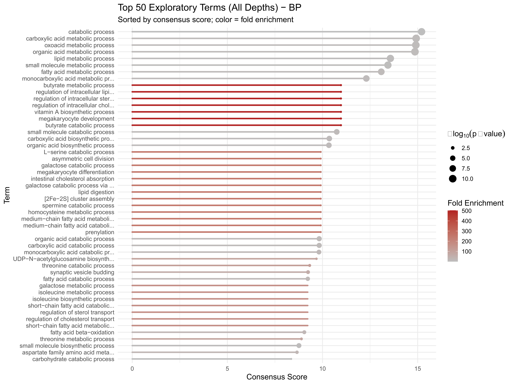
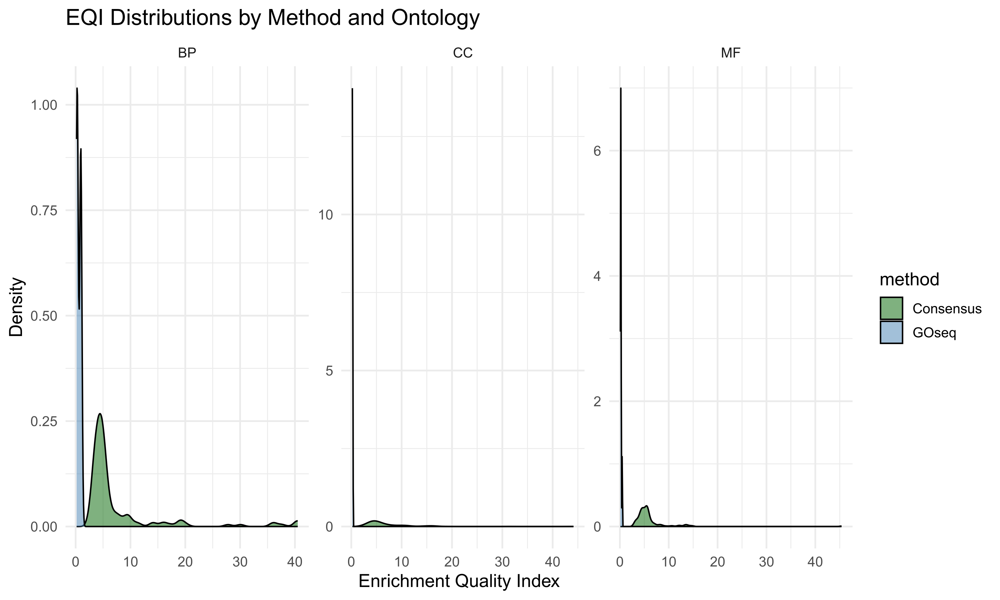
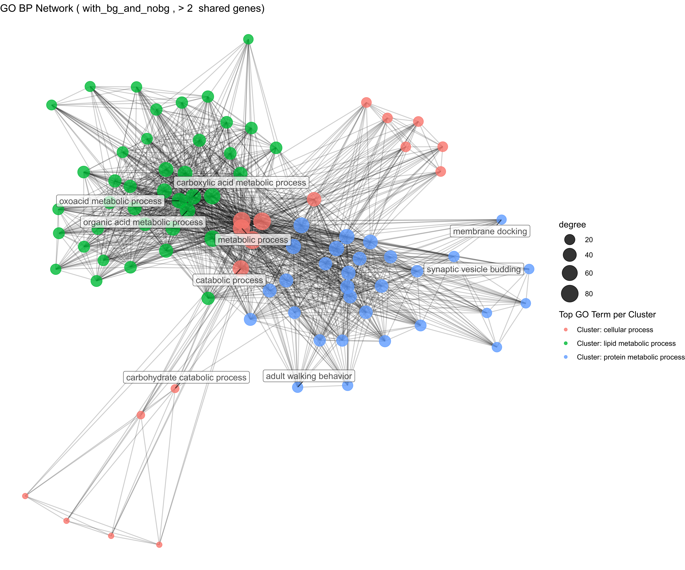

```{r setup, include=FALSE}
knitr::opts_chunk$set(
  collapse = TRUE,
  comment  = "#>",
  error    = TRUE
)
options(rmarkdown.html_vignette.check_title = FALSE)

suppressPackageStartupMessages({
  library(EchoGO)
  library(readxl)
  library(dplyr)
  library(tidyr)
  library(stringr)
  library(tibble)
  library(ggplot2)
})

# Frozen demo results shipped with the package
out <- echogo_demo_results_path()
```

# Purpose of this vignette

This vignette shows how to read and interpret EchoGO outputs using the frozen demo results shipped with the package. It mirrors the EchoGO interpretation guide and manuscript, with emphasis on:

-   The difference between strict consensus and exploratory enrichment.
-   Which files to look at first (and which ones are diagnostics).
-   How RRvGO and GO term networks help you move from long GO term lists to mechanistic stories.

All code here uses frozen demo outputs. No online calls or heavy computations are performed during vignette build.

# Core ideas at a glance

EchoGO is a modular enrichment and interpretation pipeline designed for:

-   De novo or non-model transcriptomes (e.g. *Gammarus*),
-   Multi-species orthology support (via g:Profiler),
-   Integration of GOseq and g:Profiler into a consensus view,
-   Semantic reduction (RRvGO) and network-level synthesis.

## Key concepts

**GOseq:** Bias-corrected GO enrichment (e.g., gene length bias). Uses Trinotate-derived GO terms.

**g:Profiler:** Cross-species enrichment based on orthologs in model species, run in two flavors:

-   *with custom background* → robust, conservative.
-   *without background* (genome-wide) → exploratory.

## Consensus vs. exploratory

-   **Strict / "true" consensus:** Terms supported by GOseq and/or g:Profiler with background, weighted toward agreement.
-   **Exploratory:** All significant terms from any source (GOseq; g:Profiler with and without background).

## Origin and scoring

Each term is annotated with:

-   Where it came from (GOseq, g:Profiler with background, g:Profiler without background, or combinations),
-   How many species support it,
-   Two composite scores: `consensus_score` (strict) and `consensus_score_all` (exploratory).

# Loading the demo consensus table

We start from the main consensus table in the frozen demo snapshot:

```{r load_consensus}
cons_xlsx <- file.path(
  out, "consensus", 
  "consensus_enrichment_results_with_and_without_bg.xlsx"
)
stopifnot(file.exists(cons_xlsx))

cons <- read_xlsx(cons_xlsx)
dplyr::glimpse(cons)
```

# How EchoGO scores consensus terms

This section documents the scoring logic implemented in `score_consensus_terms()`. Two composite scores are provided:

-   `consensus_score` → strict / true consensus (conservative).
-   `consensus_score_all` → exploratory (includes no-background contribution).

Both scores are weighted sums of normalized components that capture:

-   Whether GOseq supports the term,
-   How many species support the term via g:Profiler (with and without background),
-   Capped and depth-weighted fold enrichment,
-   Capped −log₁₀ p-values.

The function also computes:

-   `num_species_gprof_bg`, `num_species_gprof_nobg` → species support,
-   `bg_prev`, `nobg_prev` → normalized prevalence (0–1),
-   `origin`, `source_origin` → human-readable origin tags,
-   `significant_in_any` → whether any method supports the term.

## Components and caps

Internally, two caps are used:

-   `P_CAP = 6` → used to cap −log₁₀ p-values.
-   `FOLD_CAP = 8` → used to cap fold enrichment values.

## Species prevalence

Species support from g:Profiler is summarized as:

-   `num_species_gprof_bg` – number of species with a g:Profiler-with-background hit.
-   `num_species_gprof_nobg` – number of species with a g:Profiler-without-background hit.

These are converted to prevalence fractions:

```{r prev_pseudocode, eval=FALSE}
bg_prev <- num_species_gprof_bg / n_bg_cols
nobg_prev <- num_species_gprof_nobg / n_nobg_cols
```

where `n_bg_cols` and `n_nobg_cols` are the number of `in_*` columns for with-/without-background species. This normalizes counts to 0–1 and avoids overstating prevalence when only a few species were queried.

## p-value components

P-values are converted to capped, normalized −log₁₀ scores:

```{r logp_pseudocode, eval=FALSE}
cap_logp <- function(p, P_CAP) {
  p <- dplyr::coalesce(p, 1)
  p <- pmax(p, .Machine$double.xmin)
  pmin(-log10(p), P_CAP) / P_CAP  # scaled to [0, 1]
}
```

Two derived components are used:

```{r pval_components, eval=FALSE}
# Strict p-value component: only g:Profiler with background
comp_p_strict <- cap_logp(min_pval_gprof_bg, P_CAP)

# Exploratory p-value component: best signal across all methods
comp_p_all <- pmax(
  cap_logp(min_pval_gprof_bg, P_CAP),
  cap_logp(min_pval_gprof_nobg, P_CAP),
  cap_logp(min_pval_goseq, P_CAP)
)
```

## Fold enrichment components (depth-weighted)

Fold enrichment is capped and then modulated by term depth:

```{r fold_pseudocode, eval=FALSE}
log2p1_cap <- function(x, cap) {
  log2(1 + pmin(dplyr::coalesce(x, 0), cap))
}

depth_w <- function(d, maxd = 12L) {
  d <- suppressWarnings(as.integer(d))
  ifelse(is.na(d), 1, pmin(d / maxd, 1))
}
```

So:

-   Shallow terms (small depth) get a smaller depth weight (\< 1).
-   Deep terms (or unknown depth) keep full weight.

The fold components are:

```{r fold_components, eval=FALSE}
comp_fold_bg <- depth_w(depth) * log2p1_cap(avg_fold_gprof_bg, FOLD_CAP)
comp_fold_nb <- depth_w(depth) * log2p1_cap(avg_fold_gprof_nobg, FOLD_CAP)
comp_fold_gs <- depth_w(depth) * log2p1_cap(fold_enrichment_goseq, FOLD_CAP)
```

Intuition:

-   Strong fold enrichment in GOseq and g:Profiler with background is rewarded.
-   Exploratory g:Profiler no-background fold enrichment is included in the exploratory score.
-   Very shallow GO terms (close to the root) are down-weighted.

## GOseq indicator

GOseq support is encoded as a simple indicator:

```{r goseq_pseudocode, eval=FALSE}
comp_goseq <- as.integer(isTRUE(in_goseq))
```

This is 1 if GOseq reports the term as significant, 0 otherwise.

## Final scores and weights

Two sets of weights define how the components are combined:

```{r weights_pseudocode, eval=FALSE}
W_STRICT <- list(
  w_goseq = 1.0,
  w_bgprev = 0.8,
  w_foldbg = 0.40,
  w_foldgs = 0.40,
  w_p = 0.40
)

W_ALL <- list(
  w_goseq = 1.0,
  w_bgprev = 0.7,
  w_nbprev = 0.3,
  w_foldbg = 0.35,
  w_foldnb = 0.25,
  w_foldgs = 0.35,
  w_p = 0.35
)
```

### Strict consensus: `consensus_score`

```{r strict_score, eval=FALSE}
consensus_score <- W_STRICT$w_goseq * comp_goseq +
  W_STRICT$w_bgprev * bg_prev +
  W_STRICT$w_foldbg * comp_fold_bg +
  W_STRICT$w_foldgs * comp_fold_gs +
  W_STRICT$w_p * comp_p_strict
```

### Exploratory consensus: `consensus_score_all`

```{r all_score, eval=FALSE}
consensus_score_all <- W_ALL$w_goseq * comp_goseq +
  W_ALL$w_bgprev * bg_prev +
  W_ALL$w_nbprev * nobg_prev +
  W_ALL$w_foldbg * comp_fold_bg +
  W_ALL$w_foldnb * comp_fold_nb +
  W_ALL$w_foldgs * comp_fold_gs +
  W_ALL$w_p * comp_p_all
```

**Rule-of-thumb:**

-   Use `consensus_score` (strict) for main figures and conservative interpretation.
-   Use `consensus_score_all` to expand hypotheses and identify additional candidate processes.

# What to read first in the results directory

EchoGO organizes each comparison's outputs into a tidy structure. In the demo snapshot, you can explore the directory tree:

```         
consensus/
    plots_exploratory/
    plots_strict/
diagnostics/
evaluation/
    exploratory_no_bg/
goseq/
gprofiler/
    no_background_genome_wide/
    with_custom_background/
networks/
    with_bg/
    with_bg_and_nobg/
report/
rrvgo/
    rrvgo_exploratory_all_significant/
        OrgDb=...
    rrvgo_true_consensus_with_bg/
        OrgDb=...
```

Each folder has a specific interpretation purpose:

### **consensus/**

Where to start. Includes:

-   Consensus Excel tables

-   Curated lollipop plots

-   `plots_exploratory/` (exploratory mode)

-   `plots_strict/` (strict mode)

### **diagnostics/**

Internal QC outputs (GOseq diagnostic materials, length-bias checks).

### **evaluation/**

Evaluation plots comparing enrichment methods:

-   EQI distributions

-   Fold-enrichment distributions

-   Rarefaction curves

-   `exploratory_no_bg/` contains additional diagnostic plots for no-background g:Profiler runs.

### **goseq/**

Bias-aware GOseq enrichment outputs.

### **gprofiler/**

All g:Profiler enrichment results:

-   `with_custom_background/` → conservative, robust

-   `no_background_genome_wide/` → exploratory mode

### **rrvgo/**

Semantic similarity reduction (BP/MF/CC):

-   Treemaps

-   Bubble plots

-   Heatmaps

-   Wordcloud

-   Cluster summary tables\
    Separate folders for **True Consensus** and **Exploratory** modes.

### **networks/**

Gene-overlap GO term networks:

-   `with_bg/` → strict consensus only

-   `with_bg_and_nobg/` → exploratory networks including no-background terms\
    Static PDF/SVG + interactive HTML versions.

### **report/**

The automatically generated HTML report when `make_report = TRUE`.

# Reading the consensus table

The consensus table bundles all key metadata you need: origin, species support, scores, and IDs for plotting and networks.

```{r read_consensus}
top_consensus <- cons %>%
  dplyr::filter(significant_in_any) %>%
  dplyr::arrange(dplyr::desc(consensus_score)) %>%
  dplyr::select(
    term_id, term_name, ontology,
    num_species_gprof_bg, num_species_gprof_nobg,
    consensus_score, consensus_score_all,
    origin, source_origin
  ) %>%
  head(25)

top_consensus
```

**Typical columns worth focusing on:**

-   `term_id`, `term_name`, `ontology` – GO identifier, label, and ontology (BP/MF/CC).
-   `origin` – high-level origin categories, e.g., "GO terms – Consensus (with BG)", "GO terms – GOseq only", "GO terms – g:Profiler only (no BG)".
-   `source_origin` – fine-grained tag summarizing the combination of sources, e.g., `"GOseq+g:Profiler_BG"`, `"g:Profiler_BG+g:Profiler_noBG"`.
-   `num_species_gprof_bg`, `num_species_gprof_nobg` – number of species supporting the term via g:Profiler (with and without background).
-   `consensus_score`, `consensus_score_all` – strict vs. exploratory composite scores.
-   `significant_in_any` – `TRUE` if any of GOseq, g:Profiler with BG, or g:Profiler no-BG report the term as significant.

Figure 1 illustrates how these scores and annotations translate into a ranked list of biological processes in the demo dataset.

**Figure 1. Exploratory EchoGO lollipop plot for BP terms in the demo dataset.**\
Top exploratory BP GO/KEGG terms are ranked by the EchoGO exploratory consensus score and plotted as a lollipop chart. Each point corresponds to a GO or KEGG term, and the x-axis shows the ranking score used by EchoGO to prioritize terms (higher = stronger, more consistent signal across tools and species).

{width="100%"}

**Reading tip:** For high-confidence biological interpretation, prioritize terms that:

-   Have high `consensus_score`,
-   Are supported by GOseq and g:Profiler with background,
-   Have multi-species support (`num_species_gprof_bg ≥ 2`),
-   Form coherent clusters in RRvGO and network outputs.

# Diagnostics that build trust

EchoGO includes diagnostics to show that consensus results are not arbitrary.

## EQI and fold-enrichment distributions

The diagnostics/evaluation folder includes, for example:

-   `EQI_distribution_by_ontology`
-   `FoldEnrichment_distribution_by_ontology`

In this vignette we illustrate the EQI distribution (Figure 2).

**Figure 2. Enrichment Quality Index (EQI) by GO ontology in the demo dataset.** Each point summarizes the agreement between GOseq and g:Profiler across species for a given term and ontology. Higher EQI values indicate terms where different tools and species give more consistent evidence of enrichment.

{width="100%"}

These plots help you check:

-   Are consensus terms strongly enriched relative to the GOseq background?

-   Is there reasonable agreement between GOseq and EchoGO’s g:Profiler-based evidence?

-   Are particular ontologies (BP/MF/CC) contributing more of the high-quality signal?

If you see terms with very low EQI but high exploratory scores, they are good candidates for “hypothesis-generating” rather than “headline” results.

## Rarefaction curves: depth and saturation

Rarefaction curves track how many unique GO terms are added as you:

-   Include more tools (GOseq vs. GOseq + g:Profiler with BG vs. + no-BG), or
-   Integrate more species.

Typical files:

-   `rarefaction_curve_by_origin_true_consensus`
-   `rarefaction_curve_by_origin_exploratory`

**Figure 3. Rarefaction curves for exploratory EchoGO terms by origin.**\

The exploratory rarefaction curve shows how the number of unique significant terms increases as methods and species are added. A steep initial rise followed by a slower increase suggests that EchoGO captures a core set of robust terms and then adds more speculative terms as additional evidence sources are included.

{width="100%"}

**Interpretation:**

-   A plateau in the True Consensus curves suggests that new tools/species are not adding many new robust terms → the consensus is stable.
-   Continued growth in Exploratory curves indicates additional hypotheses that go beyond strict consensus (useful for follow-up experiments).

# Semantic similarity reduction with RRvGO

RRvGO reduces redundant GO terms into clusters of semantically similar terms, making large tables more digestible.

In the demo snapshot, you should find:

```{r rrvgo_check}
rr_true <- file.path(out, "rrvgo", "rrvgo_true_consensus_with_bg")
rr_all <- file.path(out, "rrvgo", "rrvgo_exploratory_all_significant")

data.frame(
  mode = c("True_Consensus_with_BG", "Exploratory_all"),
  exists = c(dir.exists(rr_true), dir.exists(rr_all))
)
```

If present, these folders typically contain:

-   Reduced term tables (e.g., representative terms per cluster).
-   Plots (bubble plots, treemaps, scatter plots, wordclouds) summarizing semantic themes.

```{r rrvgo_explore}
if (dir.exists(rr_true)) {
  head(list.files(rr_true, recursive = TRUE), 10)
}
```

**Figure 4. RRvGO treemap of BP True Consensus terms in the demo dataset.**\

Each rectangle corresponds to a GO term; terms are grouped into semantically similar clusters, and the area of each tile reflects the relative importance or size of that term/cluster. This provides a compact “map” of the major biological themes emerging from consensus enrichment.

{width="100%"}

**Reading tip:**

-   Identify RRvGO clusters enriched in high-`consensus_score` terms: these clusters often become your story units (e.g. “DNA repair”, “oxidative stress”, “immune activation”).

-   Within a cluster, representative terms serve as concise labels for reporting, while the full list of child terms can be explored in the RRvGO tables for mechanistic detail.

-   For more complex projects, RRvGO can also be used in comparison modules (e.g. shared vs. unique terms across treatments) to reduce redundancy there as well.

# Networks: from term lists to systems

Network analysis shows how GO terms are connected via shared genes, helping you see modules and hubs.

```{r network_explore}
net_dir <- file.path(out, "networks")
head(list.files(net_dir, recursive = TRUE), 10)
```

**Typical structure:**

-   Separate networks for each ontology (BP, MF, CC).
-   Two flavors:
    -   `with_bg/` → only strict, background-corrected terms (True Consensus).
    -   `with_bg_and_nobg/` → includes exploratory terms as well.

**Figure 5. GO term overlap network for BP terms in the exploratory EchoGO set.**\

Nodes represent BP GO terms, and edges connect terms that share genes. Densely connected regions correspond to functional modules, while highly connected nodes act as hubs linking different processes.

{width="100%"}

**How to read them:**

-   **Nodes** = GO terms (annotated with scores, ontology, and sometimes species support).
-   **Edges** = gene overlap between terms (stronger overlap → thicker or darker edges).
-   **Clusters / communities** = functional modules (e.g., stress response, metabolism).

**Interpretation strategy:**

-   Start with strict networks (`with_bg/`) to identify core modules.
-   Then inspect exploratory networks to see which extra terms connect to or extend these modules.

# Minimal plotting example from the consensus table (exploratory mode)

The demo snapshot already includes rich plots under `consensus/`. Here we show a very small, CRAN-friendly example: a lollipop-style plot of the top 10 exploratory consensus terms by ontology.

```{r minimal_plot, fig.width=6, fig.height=5, dpi=120}

# Improved minimal plotting example (exploratory)

plot_df <- cons %>%
  dplyr::filter(significant_in_any, !is.na(consensus_score_all)) %>%
  dplyr::slice_max(consensus_score_all, n = 15, with_ties = FALSE) %>%   # smaller = cleaner
  dplyr::mutate(
    term = stringr::str_trunc(
      paste0(term_name, " (", term_id, ")"), 
      50
    )
  ) %>%
  dplyr::arrange(consensus_score_all) %>%
  dplyr::mutate(term = factor(term, levels = term))

ggplot(plot_df, aes(
  y = term,
  x = consensus_score_all
)) +
  geom_segment(aes(
    yend = term,
    xend = 0
  ), linewidth = 0.6, color = "grey70") +
  geom_point(
    aes(color = ontology),
    size = 2.5
  ) +
  scale_color_brewer(palette = "Dark2") +
  labs(
    x = "Consensus score (exploratory)",
    y = NULL,
    title = "Top 15 exploratory GO/KEGG terms by consensus score"
  ) +
  theme_minimal(base_size = 11) +
  theme(
    axis.text.y = element_text(size = 8),
    legend.position = "bottom",
    plot.title = element_text(hjust = 0.5)
  )

```

# Practical checklist for your own analyses

When you run EchoGO on your own data, a robust interpretation workflow is:

1.  **Start in `consensus/`**
    -   Open the consensus table.
    -   Filter by `significant_in_any == TRUE`.
    -   Rank by `consensus_score` (strict) and scan top terms.
2.  **Check diagnostics** (`diagnostics/` or `evaluation/`)
    -   Look at EQI and fold enrichment distributions.
    -   Inspect rarefaction curves for stability vs. exploratory expansion.
3.  **Use RRvGO** (`rrvgo/`) **to reduce redundancy**
    -   Focus on clusters enriched in high-score terms.
    -   Use these clusters as your mechanistic labels.
4.  **Use networks** (`networks/`) **for systems-level stories**
    -   Identify modules and hubs.
    -   Compare strict vs. exploratory network variants.
5.  **Report**
    -   Base the main figures and narrative on strict consensus terms.
    -   Mention exploratory findings as hypotheses / candidates backed by cross-species evidence.

# References & further reading

-   Young et al. (2010) *Genome Biology* — GOseq: bias-aware GO enrichment.
-   Raudvere et al. (2019) *Nucleic Acids Research* — g:Profiler: functional profiling of gene lists.
-   Sayols (2023) — RRVGO: semantic similarity reduction for GO terms.

For more detail, see:

-   `vignette("EchoGO_workflow")` for running the pipeline.
-   The full EchoGO interpretation guide and manuscript bundled with the project.

# R session
```{r session-info, echo=FALSE}
sessionInfo()
```
